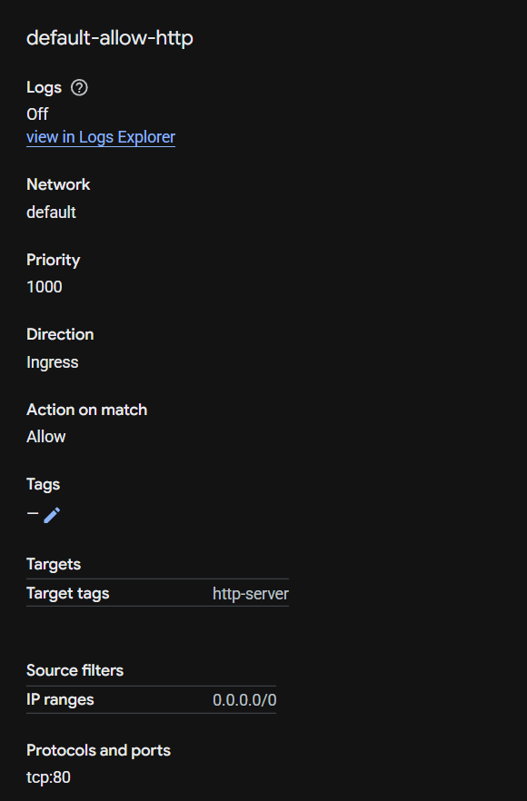
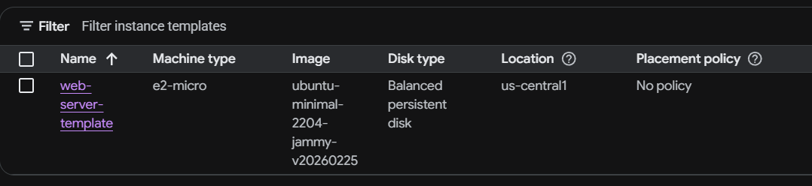
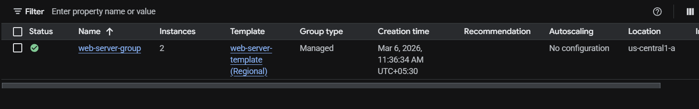
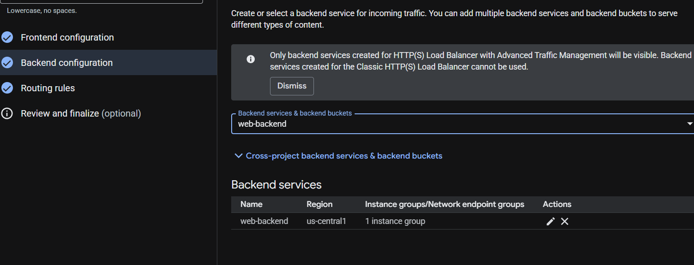
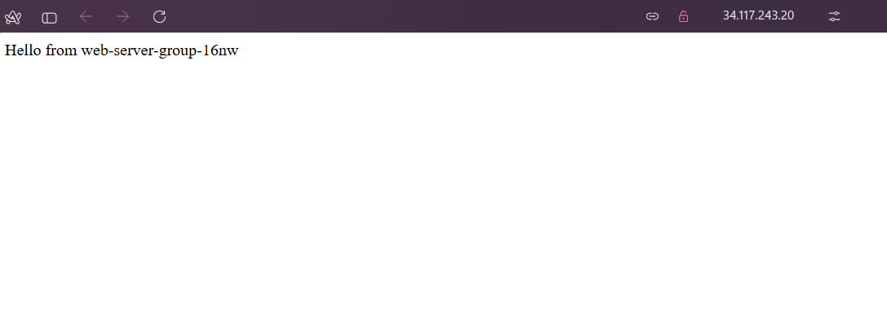

# GCP Load Balanced Web Server Architecture

## Overview

This project demonstrates how to deploy a **scalable web architecture on Google Cloud Platform (GCP)** using load balancing and managed instance groups.

The architecture distributes incoming user traffic across multiple virtual machines to ensure **high availability, reliability, and scalability**.

---

## Architecture Diagram

```
Internet Users
        ↓
Global HTTP Load Balancer
        ↓
Backend Service
        ↓
Managed Instance Group
     ↓            ↓
VM Instance 1   VM Instance 2
   (NGINX)         (NGINX)
```

---

## Services Used

* Google Compute Engine (VM instances)
* Google Cloud Load Balancing
* Google Cloud VPC
* Managed Instance Groups
* Instance Templates
* Firewall Rules

---

## Key Features

* Custom VPC network and subnet configuration
* Firewall rules allowing HTTP traffic (port 80)
* Automated VM deployment using Instance Templates
* Managed Instance Group for automatic VM management
* Global HTTP Load Balancer distributing traffic across instances
* Health checks to ensure traffic is routed only to healthy servers

---

## Step-by-Step Implementation

### 1. Create Custom VPC Network

* Created a custom VPC named **web-vpc**
* Added subnet **web-subnet**
* CIDR block: `10.0.1.0/24`

Screenshot:


---

### 2. Configure Firewall Rule

Allowed HTTP traffic from the internet.

Rule configuration:

* Direction: Ingress
* Protocol: TCP
* Port: 80
* Source: `0.0.0.0/0`

Screenshot:



---

### 3. Create Instance Template

Configured VM blueprint with startup script to automatically install NGINX.

Startup Script:

```bash
#!/bin/bash
apt-get update
apt-get install -y nginx
echo "Hello from $(hostname)" > /var/www/html/index.html
systemctl restart nginx
```

Screenshot:



---

### 4. Create Managed Instance Group

Instance group configuration:

* Instance template: web-server-template
* Zone: us-central1-a
* Instances: 2

Managed Instance Groups automatically maintain the desired number of instances and replace failed VMs.

Screenshot:



---

### 5. Configure Global HTTP Load Balancer

Frontend configuration:

* Protocol: HTTP
* Port: 80
* IP: Ephemeral external IP

Backend configuration:

* Backend service: web-backend
* Instance group: web-server-group
* Health check: HTTP port 80

Screenshot:



---

### 6. Test Load Balancing

Access the Load Balancer IP in a browser.

Refreshing the page routes traffic between VM instances.

Example output:

```
Hello from web-server-group-abc
Hello from web-server-group-def
```

Screenshot:



---

## Final Architecture

```
Internet
   ↓
Global HTTP Load Balancer
   ↓
Backend Service
   ↓
Managed Instance Group
 ↓        ↓
VM1      VM2
```

---

## Key Learnings

* Understanding of GCP networking and VPC configuration
* Deployment automation using instance templates
* High availability using managed instance groups
* Traffic distribution using global HTTP load balancing
* Health checks for backend service monitoring

---

## Future Improvements

* Add HTTPS with SSL certificates
* Enable auto-scaling based on CPU utilization
* Deploy application containers instead of static web pages
* Automate infrastructure using Terraform

---

## Author

Built as part of a **Cloud Engineering learning project** focused on Google Cloud architecture and infrastructure design.
